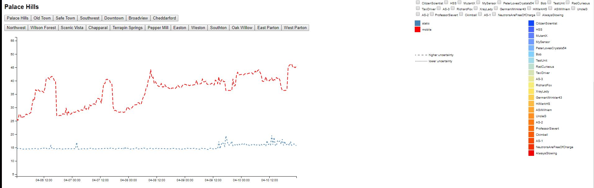
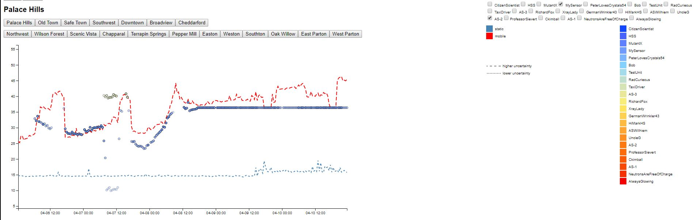

# Project-3
Data Visualization

Visualization Link: https://trobinson11.github.io/Project-3/

### Task:

  Your task, as supported by visual analytics that you apply, is to help St. Himark’s emergency management team combine data from the government-operated stationary monitors with data from citizen-operated mobile sensors to help them better understand conditions in the city and identify likely locations that will require further monitoring, cleanup, or even evacuation. Will data from citizen scientists clarify the situation or make it more uncertain? Use visual analytics to develop responses to the questions below. Novel visualizations of uncertainty are especially interesting for this mini-challenge.

### Questions:
####   1. Visualize radiation measurements over time from both static and mobile sensors to identify areas where radiation over background is detected. Characterize changes over time.

For the challenge a scatterplot and map of the city were designed in order to properly display the data from the sensors. Separate graphs were used for the Static sensors and the Mobile sensors. The Static sensor graph includes the ID of the sensors, the CPM detected by the sensors and the timestamps of each detection. The Mobile sensor graph also has the ID, CPM, and Timestamps, as well as the Longitude and Latitude of the sensors at each timestamp due to the sensors being mobile. The map displays the locations of the Static sensors, and the average CPM of the regions they reside in. It also displays the average CPM measurements of the Mobile data in each region.

In our findings, we saw that on average the CPM measurements detected by the Mobile sensors were more than double the CPM measurements detected by the Static Sensors. Also as time increased you can also see an overall increase in the CPM measurements in both sensors. 

In both graphs many isolated measurements can be seen, however due to a lack of data to predict other factors we cannot rule out these isolated measurements as being false positives or errors in the sensors. In both graphs reliable data can be observed in the form of either concurrent similar readings or concurrently increasing readings from one or more sensors, such as sensor 12 and 13’s spikes in the Static sensors graph, and the increasing, stabilizing, and decreasing of sensors 21, 24, 25, 27, 28, 29, 45 in the Mobile sensors graph. The map also shows how the Mobile sensors have an increased average compared to the Static sensors, and displays which regions are more heavily affected by radiation, through using heat maps to display the average CPM measurements.

 ####  2. Use visual analytics to represent and analyze uncertainty in the measurement of radiation across the city.

   Compare uncertainty of the static sensors to the mobile sensors. What anomalies can you see? Are there sensors that are too uncertain to trust?
   
   The static sensors consistantly have a lower reading than the mobile sensors. More so when ever an even occurs the is a larger "jump" in the mobile data than in the static data. 
   Some of these sensors are unreliable a list of a few that were deemed unreliable are:
   1. Ckimball
   2. UncleG
   3. TestUnit
   4. germanWrinkler
   5. ProfessorSievert
   
   a. Which regions of the city have greater uncertainty of radiation measurement? Use visual analytics to explain your rationale.
   
   The regions with the greatest uncertainty of radiation (where there were both static and dynamic sensors) are:
   
   1. Palace Hill
   2. Downtown
   3. Oldtown
   
   Areas that had the greatest uncertainty with only mobile data are:
   1. Wilson Foreset
   
    
   b. What effects do you see in the sensor readings after the earthquake and other major events? What effect do these events have on uncertainty?

####   3. Given the uncertainty you observed in question 2, are the radiation measurements reliable enough to locate areas of concern?

   Yes the radiation measurements are still certain enough to trust there measurments with but with the understanding that the mobile units read higher than the static units.  When there is an even that causes an increased reading the mobile units tend to respond the these at a disproprtionally high level.

   a. Highlight potential locations of contamination, including the locations of contaminated cars. Should St. Himark officials be worried about contaminated cars moving around the city?
   
   The bigest area of concerns are Northwest, Oak Willow and Chapparal. They should be concerned however it does not appear that these cars are causing dangerously high radiation levels. It appears that the cars are leaving Safe Town through Cheddarford, East Parton and Easton. They are probably then residing at Northwest, Oak Willow and Chapparal. We determine this through tracking upward "ticks" in the radiation readings for the drive through areas and the longer periods of radiation spikes in the neighborhoods of residence.
   
   b.Estimate how many cars may have been contaminated when coolant leaked from the Always Safe plant. Use visual analysis of radiation measurements to determine if any have left the area.
   
   c. Indicated where you would deploy more sensors to improve radiation monitoring in the city. Would you recommend more static sensors or more mobile sensors or both? Use your visualization of radiation measurement uncertainty to justify your recommendation.

I would place at least one static sensor in every location. In the map depicted below there are several areas where there is no sensors, so for the static data, there is none. If there were more static sensors then you would be able to see the radiation levels in ALL locations, not just the seven locations. Mobile sensors seemed to cover all areas fairly well, so I wouldn't add more of those.

####   4. Summarize the state of radiation measurements at the end of the available period. Use your novel visualizations and analysis approaches to suggest a course of action for the city. Use visual analytics to compare the static sensor network to the mobile sensor network. What are the strengths and weaknesses of each approach? How do they support each other?
   
   At the end of the available period we saw a steep increase in the average CPM measured by both the Static sensors and the Mobile sensors. Not only do the more reliable and clustered CPM measurements increase, but we also saw an increase in the more isolated measurements through the available period. This shows that the isolated measurements may be caused by other factors that we cannot detect due to insufficient data, and that the isolated measurements may be more reliable and necessary than we initially imagined. 
   
Through our data we can propose a number of actions to take into account for the city. From the scatterplots we can see that around the Static sensors, the CPM is gradually increasing, and around particular sensors spikes in their CPM measurements can be seen. When used with the map which displays the positions of the sensors we can see which of the areas are more heavily affected and take precautionary measures against the increase in radiation. With the addition of the Mobile sensors data, we can see precisely which locations are experiencing dangerous and harmful levels of radiation by using the graphs to see specifically which locations are radioactive due to the longitude and latitude of the sensors at each timestamp the CPM measurements are recorded at. With this information we can not only see the regions with the most radiation, but we can predict which regions the radiation will spread to.

When looking at the differences between the Static and Mobile sensors, we can see that the Static sensors do not record any long concurrent periods of any increases in CPM measurements, instead it only shows spikes in the CPM readings during specific times. However the Mobile data clearly shows several periods of the sensors entering regions and locations where the CPM measurements are well over 1000 CPM. This can be chalked up to the Static sensors not being placed in good positions, and therefore not getting any meaningful data, however the Static sensors also play the very important role of providing a baseline of the average CPM measurements in a specific region. The Static sensors also show how these regions are affected by natural and man-made disasters by continually taking measurements over time. The Mobile sensors on the other hand play the role of showing the most heavily affected areas by having the ability to go to them directly. Combined with the Static sensors we can see how the radiation spreads, and predict how each region will be affected over time. We can also use this data to determine the source of the radiation and if possible remove it or clean it up to prevent further contamination. 

####   5. The data for this challenge can be analyzed either as a static collection or as a dynamic stream of data, as it would occur in a real emergency. Describe how you analyzed the data - as a static collection or a stream. How do you think this choice affected your analysis?
   
   We got our data as a static collection. I think for answering the question of what areas are most effected this is adequate. However, if this were being used for an emergency alert system, dynamic would be better. I also think that for better results dynamic would be better, but with the already large datasize provided we were at our limit. If this challenge were to be expanded, we would need a server and a database for sure.

   

